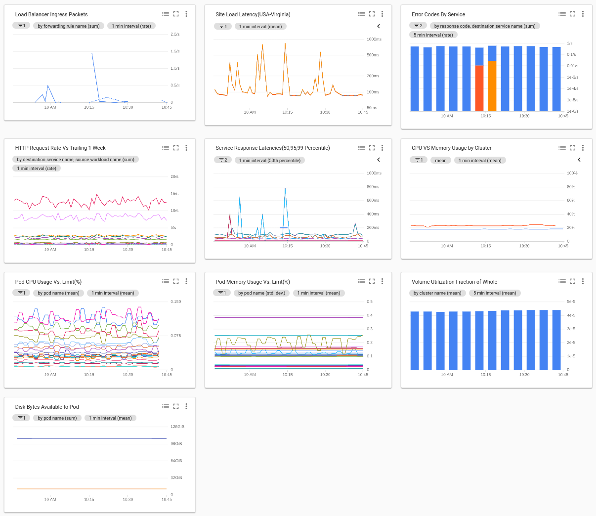

# Istio Dashboard or Google Cloud Operations 


Using cloud shell download this repo and run the dashboards.sh script to install the SRE dashbaord in Cloud Operations. Remember to replace the sample project name with your own before you run the script. 
```console
git clone https://github.com/bkauf/gcpmonitoring.git
cd gcpmonitoring
```
Change the PROJECT_ID varaible in dashboard.sh
```console
export PROJECT_ID=[yourproject]
```

Change the sample project name in the dashboards.sh script.
```console
./dashboards.sh
```


